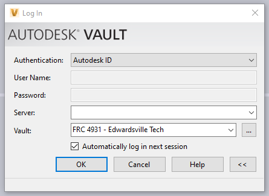
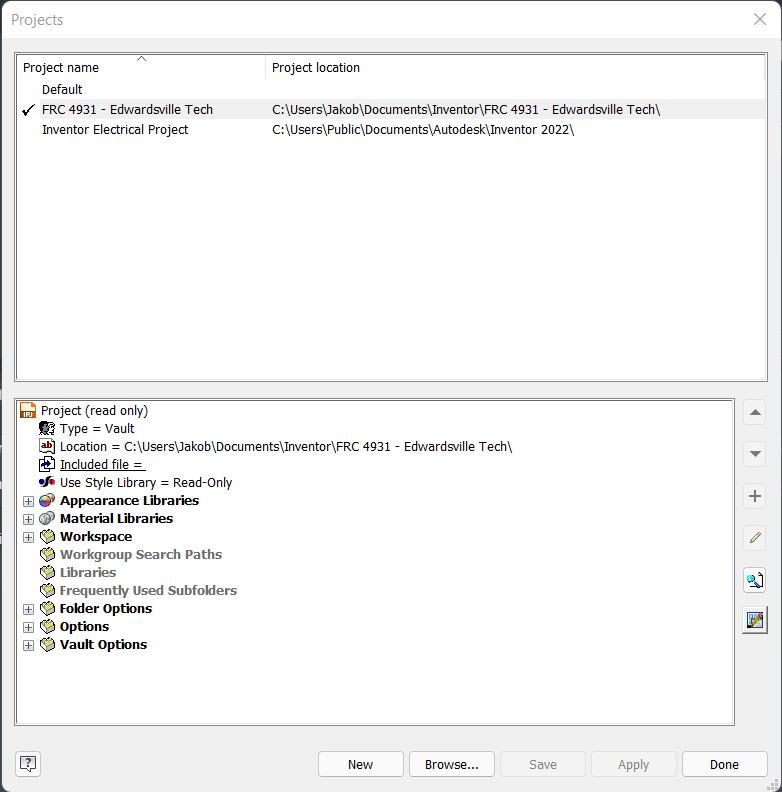
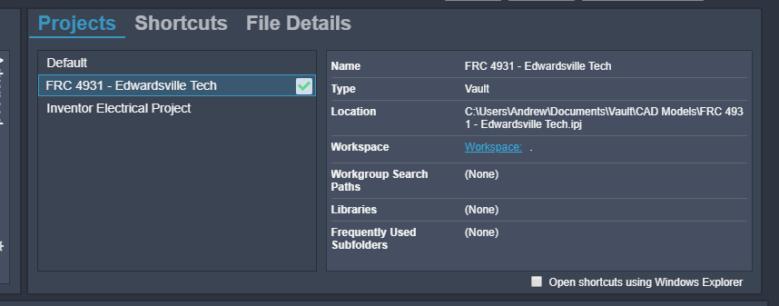
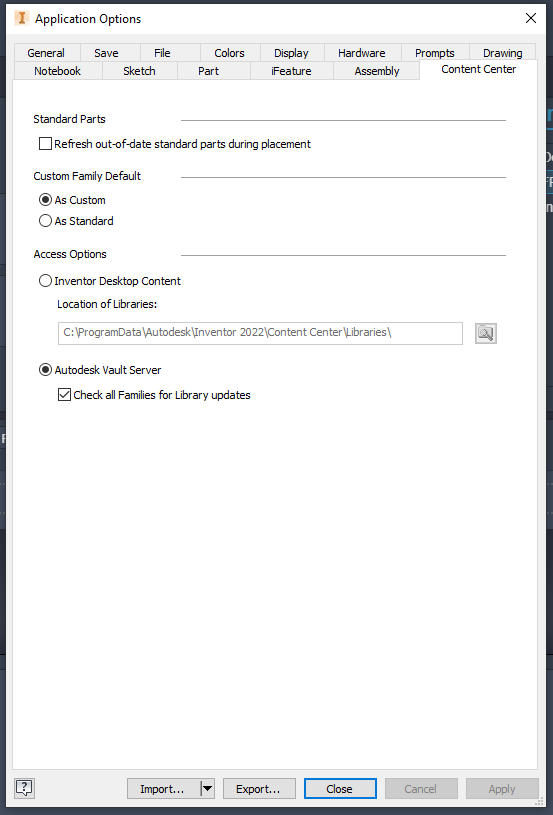

## Prerequisites

If you don't have a student or educator Autodesk account please follow [Setting up an Autodesk Account](./Setting-up-an-Autodesk-Account.md).

While it's not required for Vault you might want Inventor so that you can use the files on the Vault Server. 
You can do this here [Setting up Autodesk Inventor](./Setting-up-Autodesk-Inventor.md).

## Downloading and Installing

 1. Go to [Autodesk Account Settings](https://manage.autodesk.com/home/) click “All Products and Services” under "Products and Services” on the
left hand side.

 2. Scroll to “Inventor Professional” click view downloads.

 3. Under “Vault Basic-Client” choose what version your team is using and click “Install Now”.

## VPN

(This is what allows your computer to communicate with the vault server. It is not
like a standard vpn, this will only affect your connection with the vault server.)

Step A: [Download](https://www.zerotier.com/download/) and install ZeroTier

Step B: Go to the ZeroTier control panel(you may have to open it from the right hand
corner of your taskbar)

Step C: Add the Network ID [Given ID] at the bottom and hit Join Network.

Step D: Find your network ID at the top of the screen(Ex: a245733897). You can copy it
by going to the right-hand side of the windows taskbar, clicking on the zerotier icon, and left
clicking on “My Address”.

Send Jakob these three things:

* **Name:** John Doe

* **Your Autodesk Email:** (Ex. JohnDoeAemail.com)

* **Your ZeroTier Address:** (Ex. a36d93jfe98)

Wait for Jakob to tell you that you are good to go

## Step 5 - Login to Vault

Step A: Open inventor and make sure that you are logged into your autodesk account.(it
should force you to login if you aren’t already)

Step B: Open The Vault Basic Client.

Step C: Set “Authentication” to “Autodesk ID”

Step D: Set server to [Given IP]

Step E: Set Vault to “FRC 4931 - Edwardsville Tech”

Step F: Hit “OK” and you should load in and see our files in the left hand side of the
window.

## Step 6 - Set up Inventor Project file from Vault

Step A: (close inventor if it’s already open) In Vault Navigate to Vault Explorer ($)/CAD
Models and double click the file called FRC 4931 - Edwardsville Tech.ipj. This should open
Inventor

Step B: In the top left hand corner of the screen, under “Get Started” click “Projects”. It
should open a window like this.

Under this window you should see the FRC 4931 - Edwardsville Tech

Make sure that has a check mark next to it if not you can do that by double clicking it

This has now set your project to our vault project. You will need to use this project any time you are using vault. You can switch back to the default project by simply clicking on the checkmark next to default project on the Inventor home screen(make sure no parts, assemblies, etc are open in Inventor for it to switch).

## Step 7 - Set Up Content Center in Inventor

Step A: Under File go to Options(at the bottom of the drop down)

Step B: Go to the Content Center Tab

Step C: At the bottom under select “Autodesk Vault Server” and check the box for
“Check all Families for Library updates”

