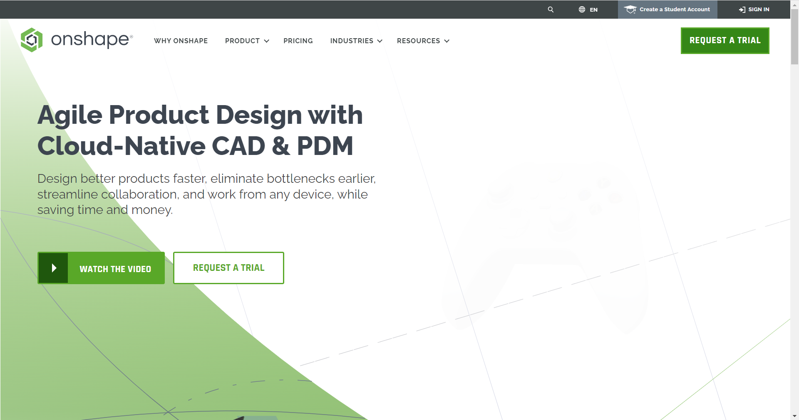
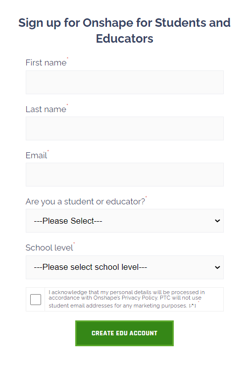
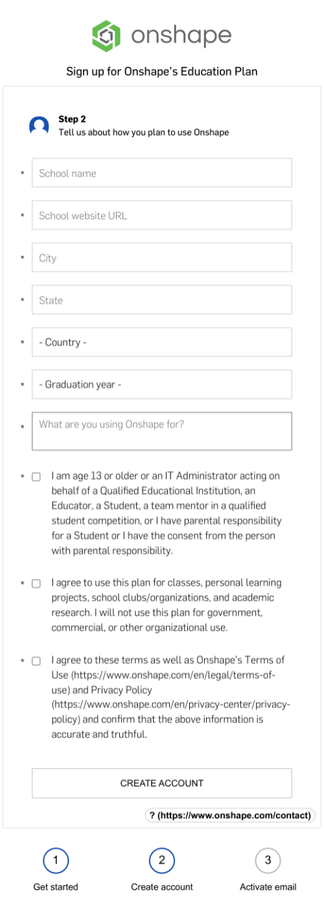
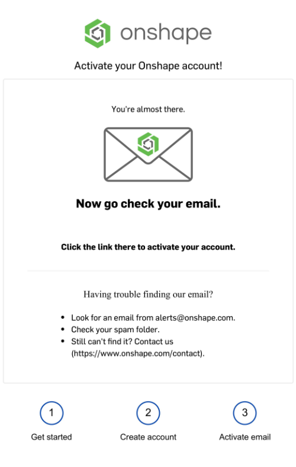
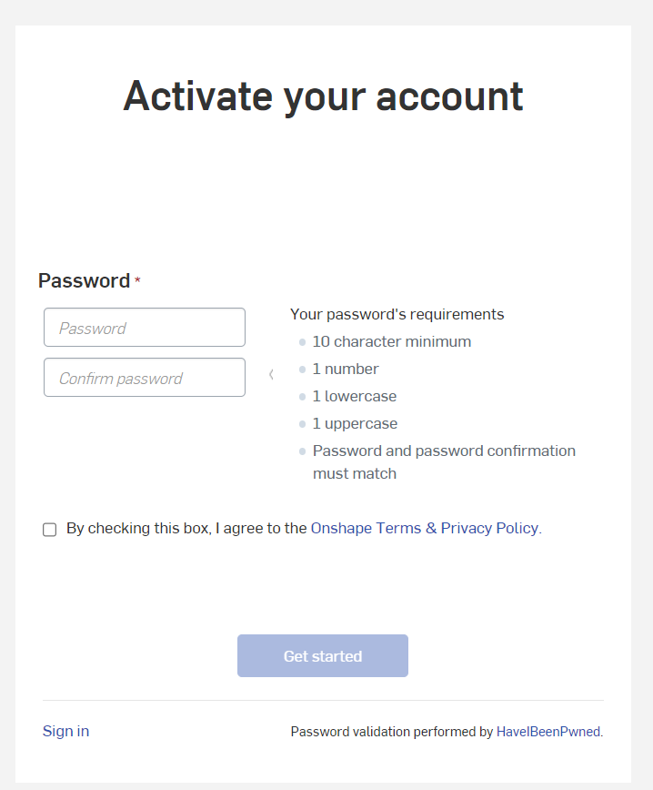
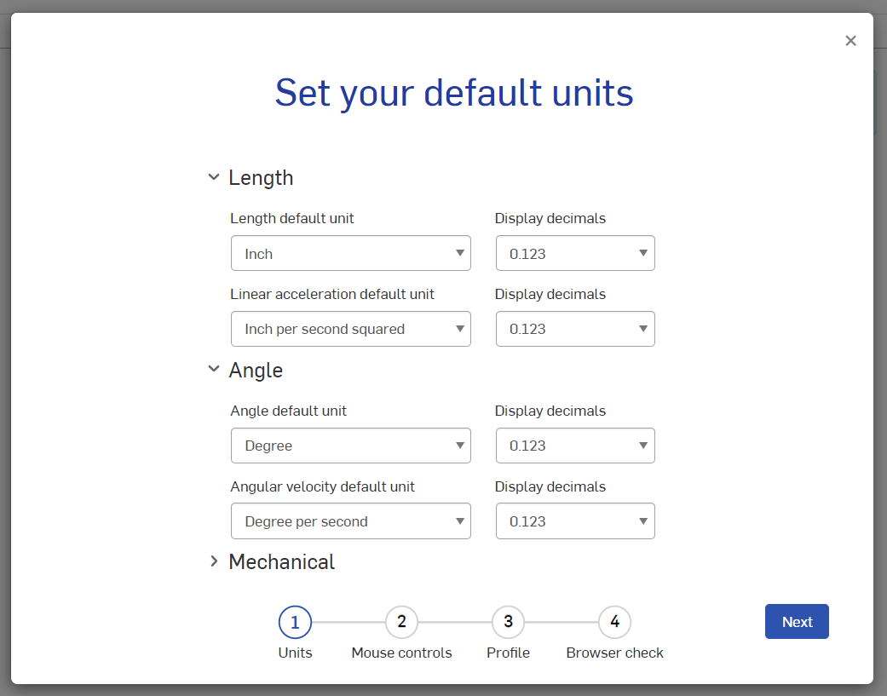
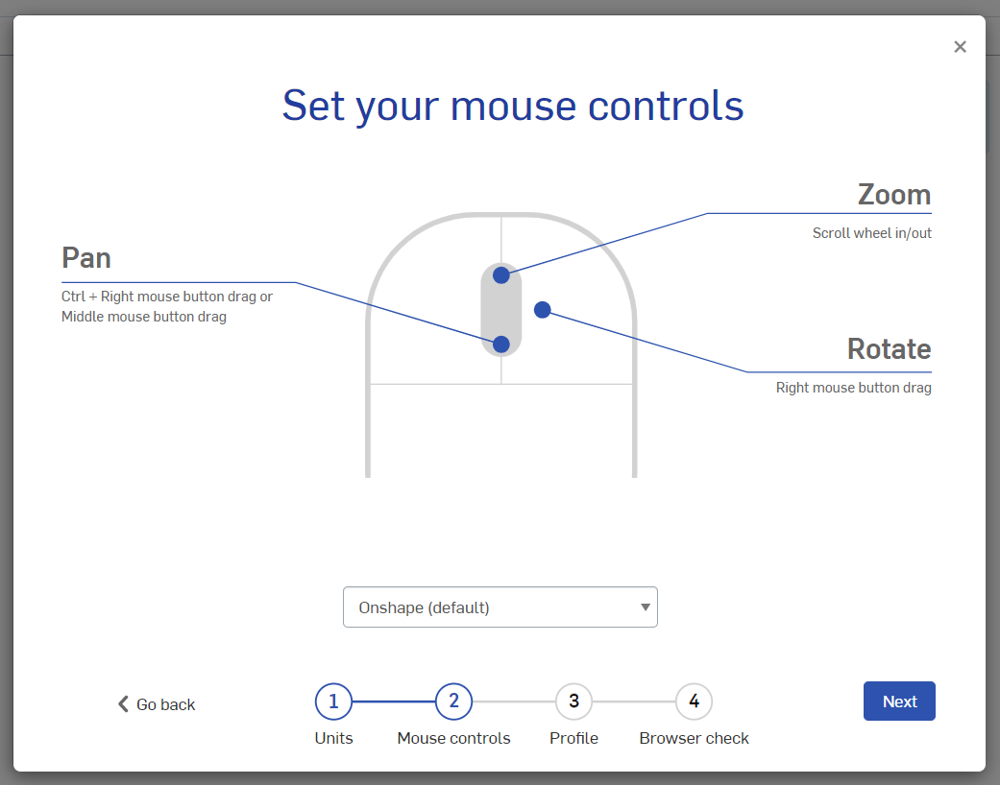
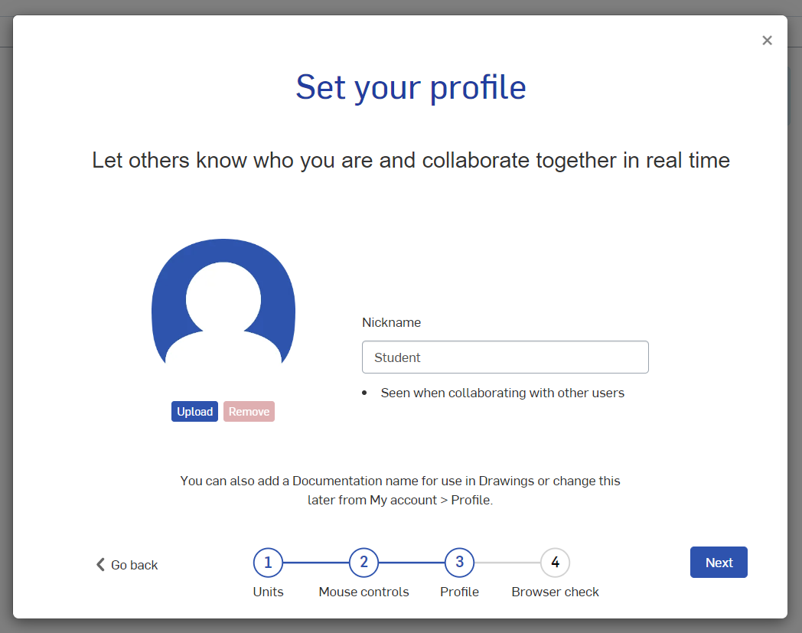

## Prerequisites

* Be a FIRST Student/Mentor

* Have an Email

## Step 1 - Account Information

 1. Go to [Onshape](https://www.onshape.com)

 2. Click Create a Student Account up in the top right

 
 3. Enter your First Name, Last Name, Email, and the two questions. (use your real name, also use an email address that you have 24/7 access to)

 4. Accept the Acknowledgement

 5. Finally Click CREATE EDU ACCOUNT

## Step 2 - School information 

 1. Enter your School name, URL, City, State, Country, and Grad Year

 2. Next enter why are you using Onshape for

 3. Check the next three boxes

 4. Click CREATE ACCOUNT

## Step 3 - Email Verification Activate

 1. Go to the email you provided and click the link given

## Step 4 - Password Setup

1. Set your password to something you are going to remember and able to type into school computers

## Step 5 - Basic Setup

 1. Everything here can be left as default

 2. Set your Nickname to your first initial then your last name

## What's next?

[Learning Onshape](./LearningOnshape.md)