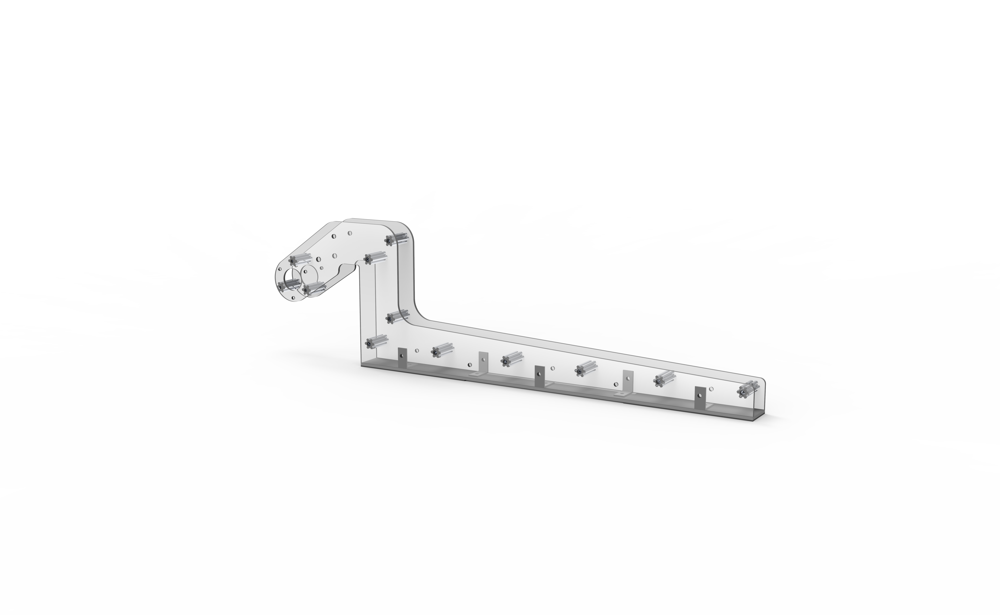

# Prototyping

Prototyping is a core skill used in robotics. It enables us to understand the interactions of how the real world and our ideas work.

## Key Objectives in Prototyping

### Explore Interactions:

 We want to see how different materials interact. How different different mechanisms work. Explore adding sensors.

### Ensure Practicality: 

We want a prototype that translates nicely to the final design. Ensuring it doesn't interfere with other components of the robot. Making sure it fits within the rules.

### Establish Consistency: 

We want to prove that we should spend more time on this idea. But also that it's reliable and doesn't degrade over time.

## Case Study I: Destination Deep Space Ground Pickup

 

### Purpose:

The 

## Case Study II

