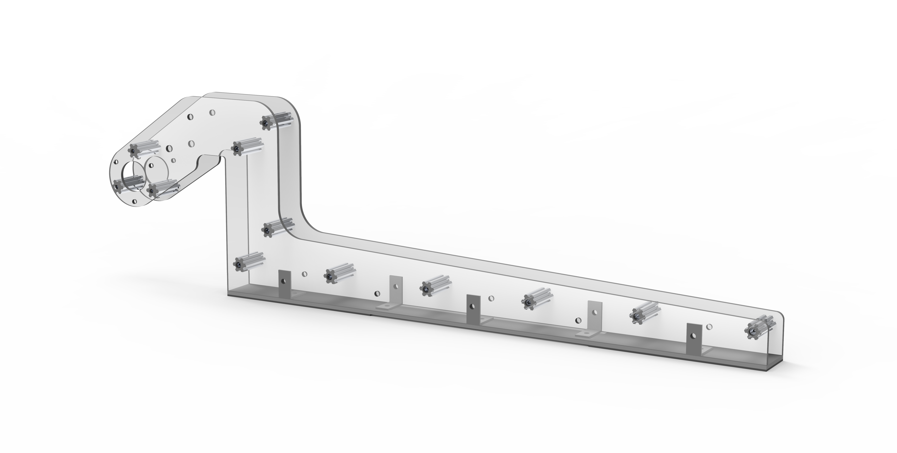

# Prototyping

Prototyping is a core skill used in robotics. It enables us to understand the interactions of how the real world and our ideas work.

## Key Objectives in Prototyping

### Explore Interactions:

 We want to see how different materials interact and how different mechanisms work. Explore adding sensors.

### Ensure Practicality: 

We want a prototype that translates nicely to the final design. Ensuring it doesn't interfere with other components of the robot. Making sure it fits within the rules.

### Establish Consistency: 

We want to prove that we should spend more time on this idea. But also that it's reliable and doesn't degrade over time.

## Case Study I: Digital Aided Prototyping

When designing a part "simulations" can only get you so far. Prototypes are great for checking clearance and verifying the design is still good. 

 

The image above shows one of the arms to a ground pickup mechanism from our 2019 robot from Destination Deep Space. It was used to pick up large disks called hatches to allow us to place them onto the cargo ship. This was almost entirely designed in CAD. Aside from one prototype side piece made of thin wood. Wood was chosen due to our ability to quickly laser cut large thin sheets of wood into just about any shape we want. That prototype was used a proof to show that that design was viable.

## Rapid Prototyping

## Case Study II: Ground Up Prototyping

Often times you just need to start testing things to develop a viable solution. 

