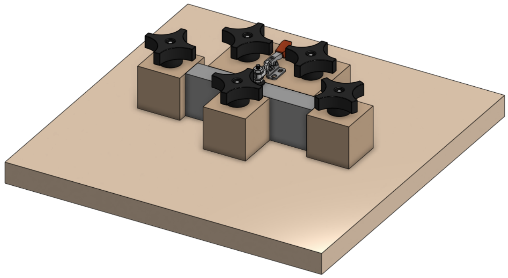
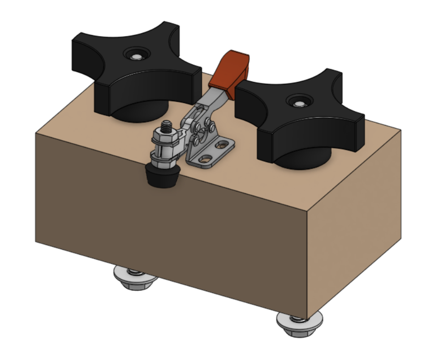
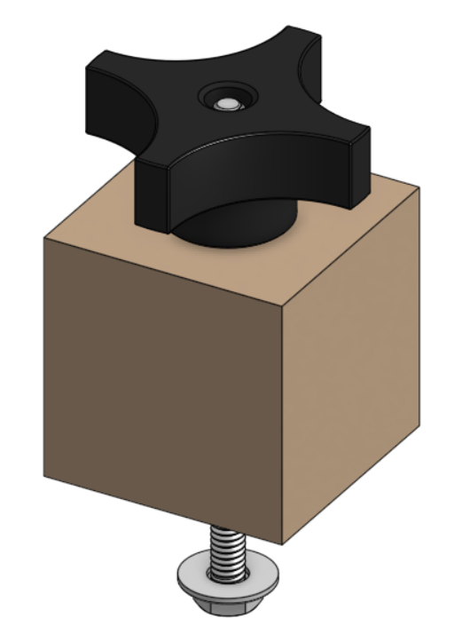

# Framing Jig

The Framing Jig is a tool designed to assist in the process of manufacturing robot frames. It ensures that the frame is held square during assembly. The jig utilizes a sacrificial reference surface and reuseable reference blocks. It’s primarily designed to keep the frame in square while fasting it together.

 

## Reference Surface

The Reference Surface is lower board that the Jig's blocks attach to. It ensures that all frame members are flush with eachother. Once the layout of the frame is deterimed. Holes for the blocks are made in the surface to allow for the blocks to be utilized. It also often incorporates access holes to the other side of the frame members that allow for installing fasteners.

## Reference Blocks

### Clamping Block
 

There are two types of reference blocks the Clamping Block and the Stopping Block. Often the Clamping Block when in conjection with the stopping block can be used to constrain the chassis all three major Axis.

### Stopping Block
 
